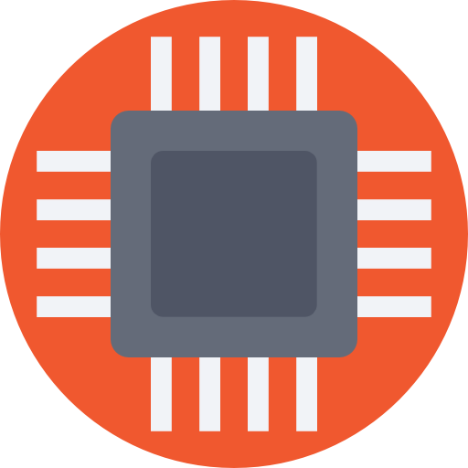

# Smart Serial

# Download (coming soon)

Latest release [here](https://github.com/serge-14/smartserialapp/releases/latest).

# Feature plan

 * Setup CI
 * Setup deployment
 * Improve unit test coverage
 * Support for DTS and RTS modes
 * RPC to control application (IDE can ask application to connect/disconnect)

# Change Log

## Version 0.1

 * List available serial ports
 * Connect/disconnect to/from serial port
 * Send/receive messages

# Credits

Icons made by [Prosymbols](http://www.flaticon.com/authors/prosymbols) from [www.flaticon.com](http://www.flaticon.com") is licensed by [CC 3.0 BY](http://creativecommons.org/licenses/by/3.0/)
